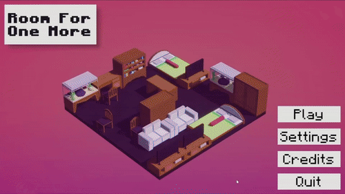
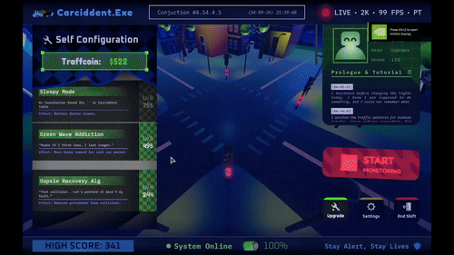
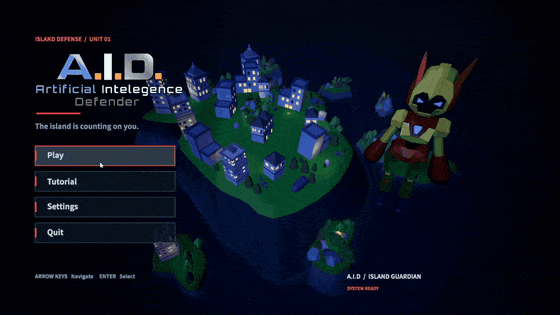
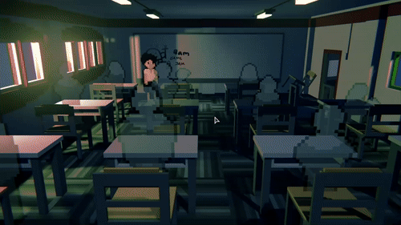

<h1 align="center">Delvin Susilo</h1>

  <strong>GAME DESIGNER · GAMEPLAY & SYSTEMS</strong>

  I like asking what a game’s rules make players do—and whether that’s the experience we intended. 
  I explore that question through gameplay loops, resource systems, and collaborative iteration.

  Game Application & Technology student at BINUS University

 

<h2>Selected Games</h2>

<table>
  <tr>
    <td width="50%" valign="top">
      
      <h3>Room for One More</h3>
      
<em>A small room. A tight budget. One more request.</em>

      
Purchase and arrange furniture to fulfill a grandmother’s requests without running out of space or money.

      
MY FOCUS · Concept, core loop & resource constraints

      
<strong>Unity</strong> &nbsp; / &nbsp; 7 days

      
<a href="https://maximillian520.itch.io/room-for-one-more"><strong>Play on itch.io ↗</strong></a>

    </td>
    <td width="50%" valign="top">
      
      <h3>Carccident</h3>
      
<em>Keep traffic moving. Patience won’t last forever.</em>

      
Control traffic lights and prevent collisions as impatient drivers begin taking matters into their own hands.

      
MY FOCUS · Core loop, scoring & UI/HUD

      
<strong>Unity</strong> &nbsp; / &nbsp; 5 days

      
<a href="https://natookie.itch.io/carccident"><strong>Play on itch.io ↗</strong></a>

    </td>
  </tr>
  <tr>
    <td width="50%" valign="top">
      
      <h3>A.I.D</h3>
      
<em>You can’t die. The city isn’t so lucky.</em>

      
Face Martin through changing boss phases, managing your energy and support drone while defending the city.

      
MY FOCUS · Gameplay systems & post-jam polish

      
<strong>Unity</strong> &nbsp; / &nbsp; 5-day jam + further polish

      
<a href="https://dupow.itch.io/aid"><strong>Play on itch.io ↗</strong></a>

    </td>
    <td width="50%" valign="top">
      
      <h3>Butt Pressure</h3>
      
<em>A different kind of pressure.</em>

      
A team game jam project featuring minigame challenges and a poop meter, with my work focused on those mechanics.

      
MY FOCUS · Minigame design, poop meter & supporting audio/fonts

      
<strong>Unity</strong> &nbsp; / &nbsp; 4 days

      
<a href="https://dupow.itch.io/butt-pressure"><strong>Play on itch.io ↗</strong></a>

    </td>
  </tr>
</table>

 

<h2>How I Think About Design</h2>

  <strong>Make the constraints matter.</strong> 
  In Room for One More, I proposed limiting furniture sales to preserve the challenge of working within a crowded room.

  <strong>Give each rule a reason.</strong> 
  In Carccident, I questioned why opposing traffic had to take turns when its paths didn’t intersect.

  <strong>Connect mechanics to the stakes.</strong> 
  In A.I.D, an invulnerable player shifts the focus toward protecting the city, managing energy, and responding to boss threats.

  CORE STRENGTHS · Gameplay loops · Systems thinking · Collaborative iteration · UI/HUD feedback

 

<h3 align="center">Let’s talk games.</h3>

  
  &nbsp;&nbsp;&nbsp;
  
  &nbsp;&nbsp;&nbsp;
  

  Learning through small games and thoughtful iteration.

